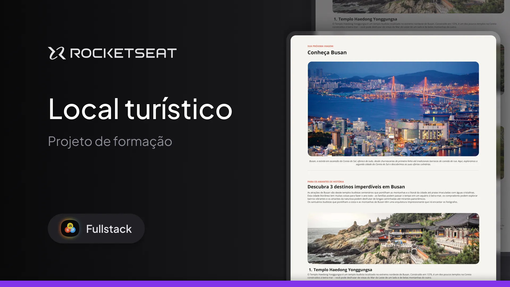

# Desafio Ponto turístico


Este é um projeto simples desenvolvido em cerca de 30 minutos como parte de um desafio proposto pela Rocketseat. O objetivo era criar uma página HTML e CSS baseada em um modelo disponibilizado no Figma.

## Sobre o Projeto

A página apresenta informações sobre um ponto turístico, com imagens, descrições e seções estilizadas. O design foi implementado seguindo as diretrizes do modelo no Figma, utilizando apenas HTML e CSS.

## Tecnologias Utilizadas

- **HTML5**: Estrutura da página.
- **CSS3**: Estilização e layout.

## Referências

- [Modelo no Figma](https://www.figma.com/community/file/1384542229391733447)  
- [Notion do Desafio](https://efficient-sloth-d85.notion.site/Desafio-pr-tico-Local-Tur-stico-c703fe13a3d44f3687277f424ffad157)

## Como Visualizar

1. Clone este repositório:
   ```bash
   git clone <url-do-repositorio>

2. Navegue até o diretório do projeto:

3. Abra o arquivo `index.html` no navegador ou utilize uma extensão como o Live Server no VS Code para visualizar o projeto.
